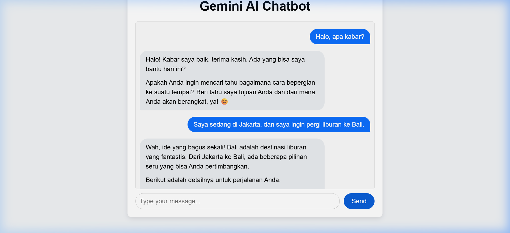

# Gemini Travel Assistant Chatbot

Welcome to the **Gemini Travel Assistant Chatbot**! This is a simple, yet powerful AI Chatbot built with Node.js, Express, and Vanilla JavaScript, powered by the incredible Google Gemini API (`@google/genai`).

This project specifically acts as an **Expert Travel Assistant**. It uses a detailed system prompt to help you plan trips. 

## 🗺️ About the Travel Assistance Feature
The bot strictly enforces a structured conversation to provide the best travel plans. You can ask it for holiday recommendations, and it will:
1. **Always Verify Origin**: If you say "I want to go to Bali," it will stop and ask you where you are traveling from first.
2. **Detailed Itineraries**: Once it has your origin and destination, it calculates:
   - **Transportation Options**: Recommends the best way to travel there (e.g., flight) and provides a realistic alternative (e.g., bus + ferry).
   - **Estimations**: It provides an estimated price, distance, and travel time.
3. **Local Recommendations**:
   - Suggests local main courses or foods you must try.
   - Highlights popular tourist spots and attractions.
4. **Bahasa Indonesia Only**: The bot is prompted to exclusively reply in **Bahasa Indonesia**, making it a highly specialized regional assistant, regardless of what language the user types in!

## 📸 Preview

### Chat Example (Bahasa Indonesia)
This screenshot demonstrates a sample chit-chat in Bahasa Indonesia ("Halo, apa kabar?") followed by asking for travel plans to Bali from Jakarta.



### Video Walkthrough
Below is an animated walkthrough of the interaction:


---

## 🚀 Installation & Setup

1. **Clone the repository** (if you haven't already) or simply download the source code.
2. **Install the dependencies**:
   ```bash
   npm install
   ```

## 🔑 Setting up the Gemini API Key

This application requires a Google Gemini API Key to function. 

1. Go to Google AI Studio and grab your API Key.
2. Inside the root of the text project directory, examine the file named `.env`.
3. Add your key inside:
   ```env
   GEMINI_API_KEY=your_api_key_here
   ```

## 💬 How to Use It

1. **Start the local server**:
   ```bash
   node index.js
   ```
2. Open your web browser and go to:
   ```
   http://localhost:3000
   ```
3. **Start chatting!** 
   - *Example prompt 1*: "Halo bot!"
   - *Example prompt 2*: "Saya ingin liburan ke Tokyo. Saya berangkat dari Jakarta."

Enjoy your fully-formatted Markdown travel guides!
